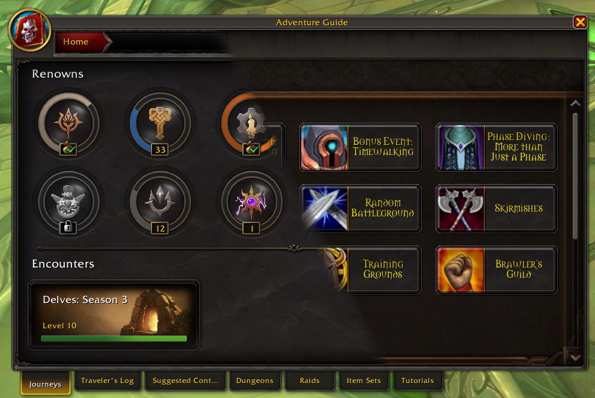

# LS: Whistles

Where are the bells tho?

## Download

- [Curse](https://www.curseforge.com/wow/addons/ls-whistles)
- [Wago](https://addons.wago.io/addons/ls-whistles)

## Options

The config is available via the addon compartment. Some action bar settings are available via edit mode to better support layouts.

## Feedback and Feature Requests

If you found a bug or want to share an idea on how to improve my addon, either use the issue tracker on [GitHub](https://github.com/ls-/ls_Whistles/issues) or join our [Discord](https://discord.gg/7QcJgQkDYD) server.

## Localisation

Feel free to add and/or review translations on [CurseForge](https://www.curseforge.com/wow/addons/ls-whistles/localization), alternatively, you may create a PR on [project's GitHub page](https://github.com/ls-/ls_Whistles/pulls).

## License

Please see [LICENSE](https://github.com/ls-/ls_Whistles/blob/master/LICENSE.txt) file.
